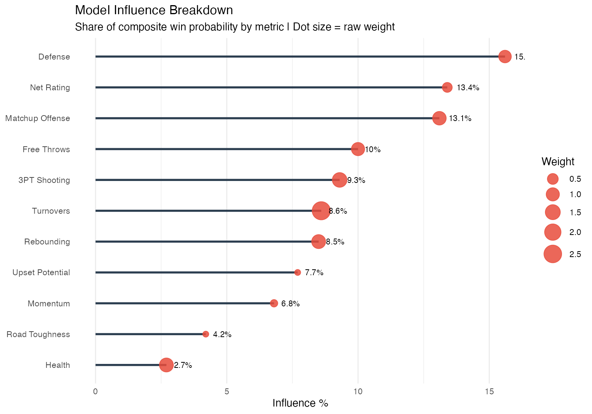
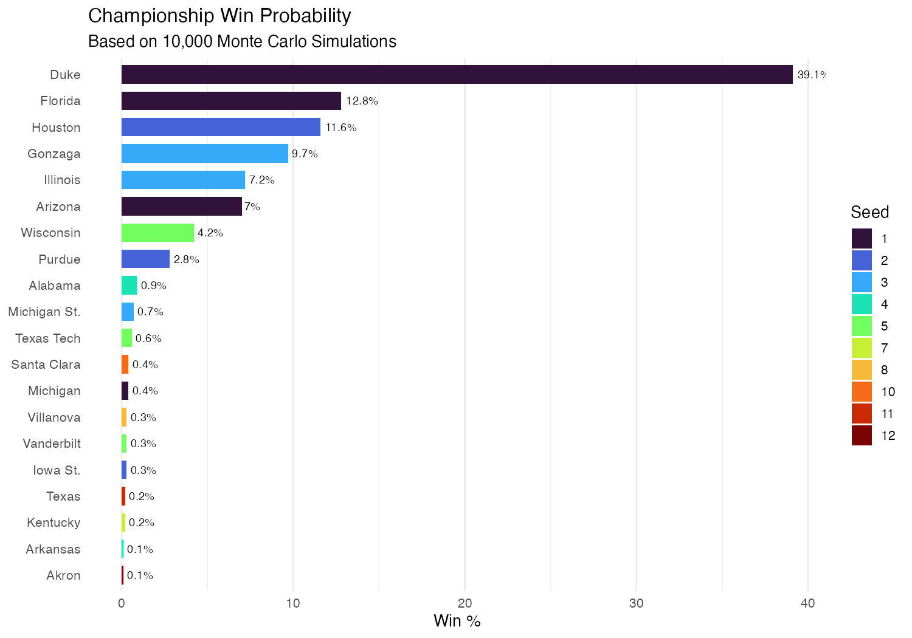
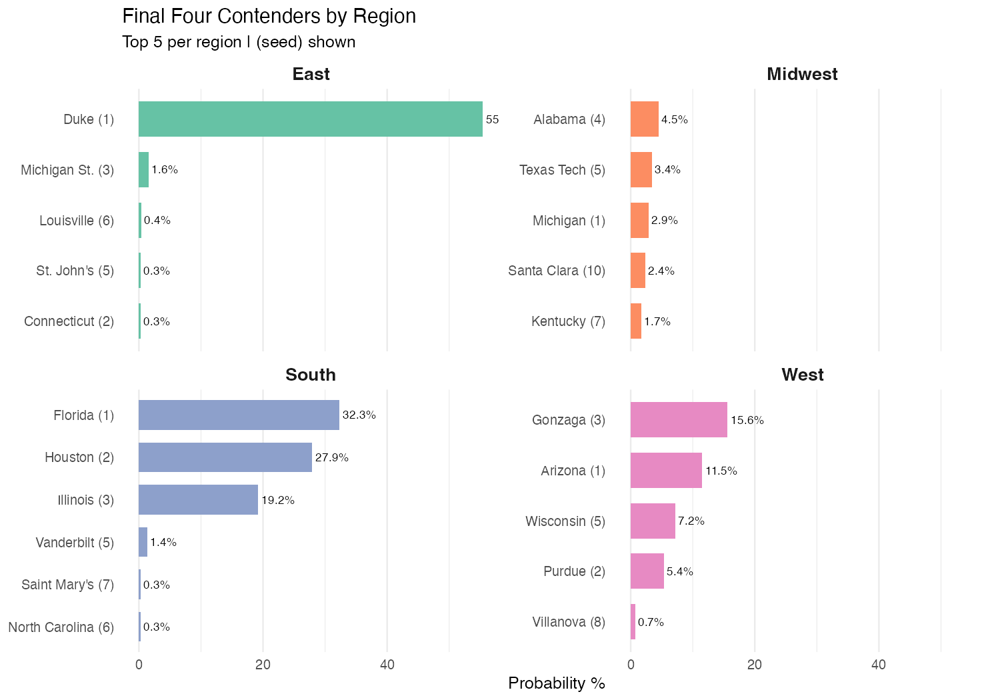
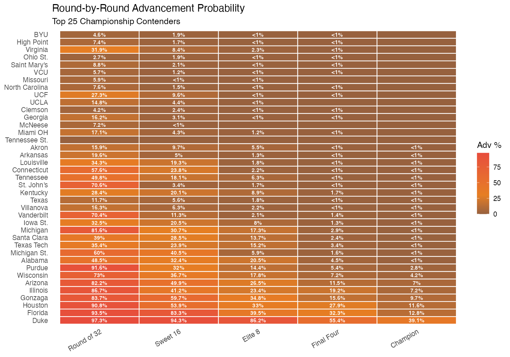
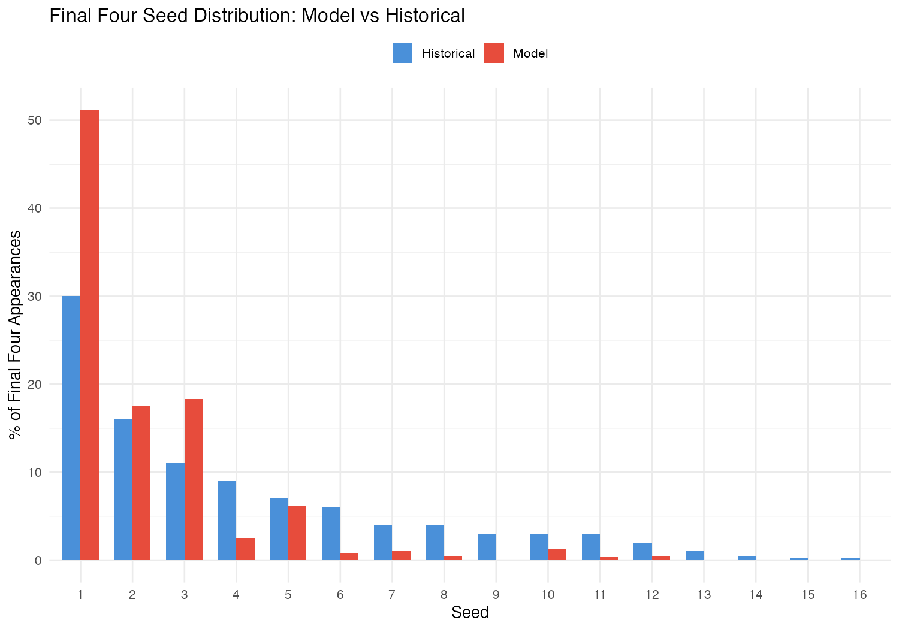
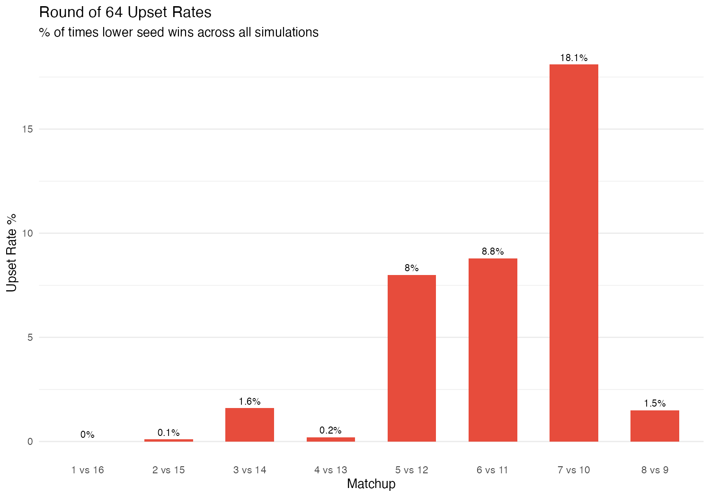
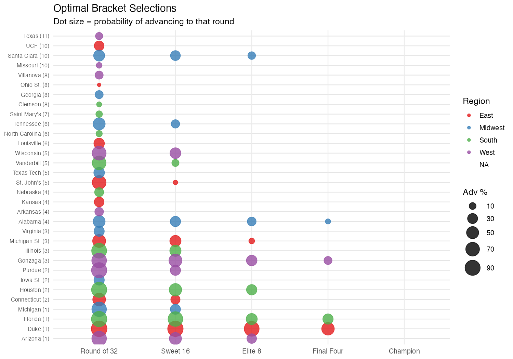

# March Madness — Monte Carlo Bracket Model

A stats-driven tournament simulation that runs 10,000 brackets and picks the most likely outcomes. Built in R using KenPom ratings, ESPN box scores, and hoopR data.

------------------------------------------------------------------------

## How It Works

The model simulates the entire 68-team NCAA tournament 10,000 times using a **head-to-head matchup engine** that compares teams across 11 weighted metrics. Each simulation adds random noise (fat-tailed distributions) to capture the chaos of March — hot shooting nights, cold streaks, and Cinderella runs.

### Data Sources

-   **KenPom Ratings** — Adjusted offensive/defensive efficiency, tempo, luck, SOS
-   **ESPN Box Scores** (via `hoopR`) — Turnover %, FT%, 3PT%, rebounding, last 10 games
-   **ESPN Standings** — Road win %, ranked opponent win %
-   **Manual inputs** — Team health/injury status

------------------------------------------------------------------------

## The Matchup Engine

Every game compares two teams head-to-head across these factors:

| Metric | What It Captures |
|------------------------------------|------------------------------------|
| **Defense** | Direct Adj_DefE comparison — elite defense travels in March |
| **Matchup Offense** | T1 offense vs T2 defense (and vice versa) — not just raw scoring |
| **Free Throws** | Clutch factor — close tournament games are won at the line |
| **Net Rating** | Overall team quality signal (luck-regressed) |
| **3PT Shooting** | THE upset variable — a hot-shooting mid-major can beat anyone |
| **Turnovers** | Sloppy teams get punished hard; low-TO underdogs thrive |
| **Upset Potential** | Ranked wins + last 10 game performance |
| **Rebounding** | Second-chance points swing games |
| **Momentum** | Teams peaking at the right time |
| **Road Toughness** | Road-tested teams handle neutral court pressure |
| **Health** | Manual injury penalties for teams missing key players |

### Key Model Features

-   **Per-tournament noise** — Each sim randomly shifts team ratings (fat-tailed `t-distribution`) so some teams "catch fire" and others go cold
-   **Per-stat noise** — FT%, 3PT%, turnover rate all vary per simulation to capture real game variance
-   **Regional path difficulty** — Stronger regions penalize their teams (harder path to F4)
-   **Bracket-aware** — Respects actual matchup paths; no impossible advancement

------------------------------------------------------------------------

## Championship Probabilities

Who wins it all across 10K simulations:

------------------------------------------------------------------------

## Final Four Contenders by Region

The top 5 most likely Final Four teams from each region:

------------------------------------------------------------------------

## Round-by-Round Advancement

How the top 25 contenders fare through each stage:

------------------------------------------------------------------------

## Final Four Seed Distribution

Does the model produce realistic upsets? Compared against historical NCAA tournament data:

------------------------------------------------------------------------

## Round of 64 Upset Rates

How often lower seeds pull off first-round upsets:

------------------------------------------------------------------------

## 🏆 The Optimal Bracket

After 10K simulations, the model builds a single **bracket-path-aware** selection by picking the most probable winner of each actual matchup through the tournament:

### 

## Health Adjustments

Injuries matter. These teams received manual penalties:

| Team           | Penalty | Severity           |
|----------------|---------|--------------------|
| Duke           | -6      | Key player concern |
| Michigan       | -5      | Key player concern |
| Alabama        | -12     | Major absence      |
| Texas Tech     | -10     | Major absence      |
| Connecticut    | -4      | Moderate           |
| SMU            | -4      | Moderate           |
| North Carolina | -4      | Moderate           |
| Clemson        | -3      | Minor              |
| BYU            | -3      | Minor              |
| Siena          | -3      | Minor              |

------------------------------------------------------------------------
